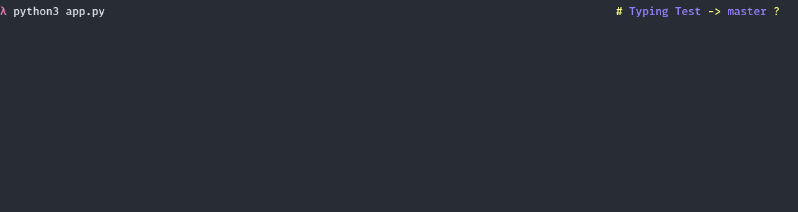
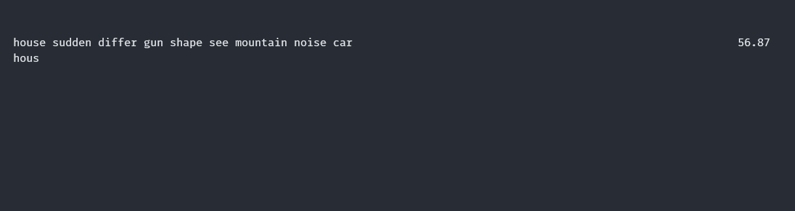

# Terminal Typing Test

## Summary
This project was written in Python and is supposed to be a open source terminal based Typing Test. 

## Samples
#### Running

---

### Results

---

## Requirements

- As this project is in python so the interpretter must be installed from [Python Download](https://www.python.org/downloads/)

### Windows

    pip install windows-curses

### Mac / Linux
    pip3 install curses

## Running the Program
To run simple type the following in the terminal / command prompt
### Windows

    python terminal-typing-test.py

### Mac / Linux
    python3 terminal-typing-test.py

## Working
This project has the following 

- It uses a dictionary of a 1000 commonly used english words and selects 12 random words to make up for a line.
- With the press of each `spacebar` the word just entered disappears from the line.
- Once the user has completed a new line emerges.
- In the end after `~60 secs` the  test completes and a result card is displayed.